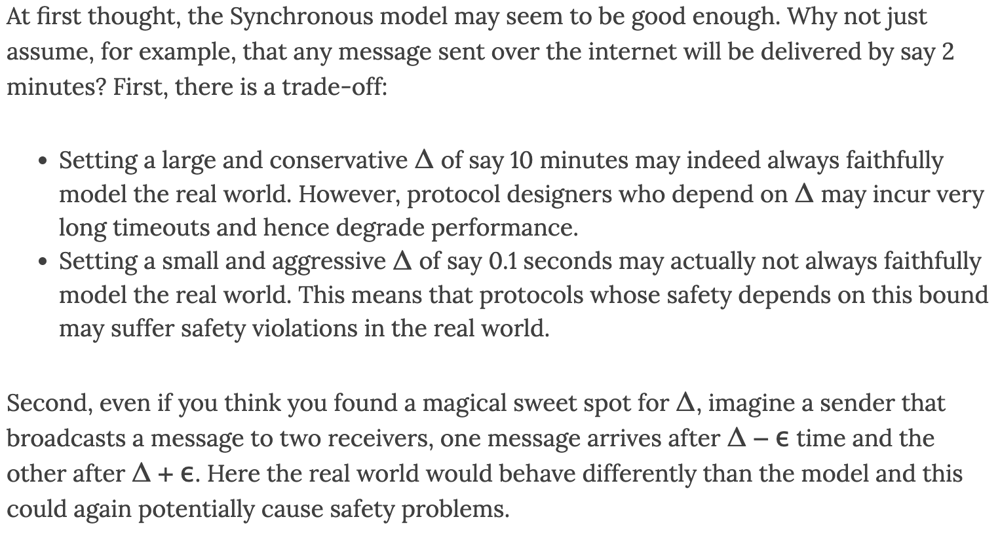

# Communication model
Source: https://decentralizedthoughts.github.io/2019-06-01-2019-5-31-models/

There are three communication models
1. Synchronous model: there exists some finite time bound $\triangle$. An adversary can delay at most $\triangle$
* Provide a known time bound $\triangle$ before hand
* Synchronous problems in a distributed system:

2. Asynchronous model: there is no bound to time delay. An adversary can delay messages forever
* Since they cannot use any fixed values for timeouts, they must inherently adapt to the actual latency of the system. Which can be very resource intensive or efficient.

3. Partial synchrony model: there exists a finite time bound to message delay. Guaranteed Delivery Time = $\max(x + \triangle, \text{GST})$ where GST is **Global Stabilization Time**
* An adversary must cause GST event to happen after some unknown finite time
* the system behaves asynchronously till GST and synchronously after GST